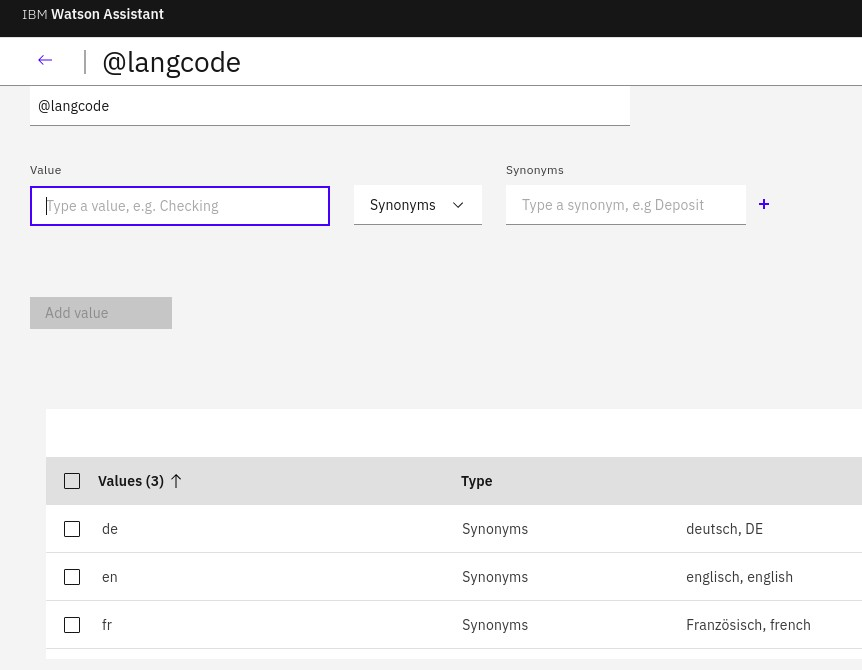
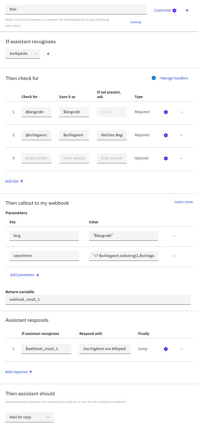

# Instructions for hands-on session

We are going to create a small chatbot which is able to either **tell a joke** or **look something up in Wikipedia**. 

Telling a joke is an example for detecting a specific intent or goal and then reacting with static responses. The responses can vary, e.g., the chatbot can print any joke from a given list. To be able to complete this task, the chatbot needs to detect the user's intent to have a joke told. Thus, we need to define an **intent** to match requests for a joke. Thereafter, we can define a **dialog node** which reacts to such a request and responds with a joke.

The second chatbot feature, looking something up in Wikipedia, is more complicated and shows dynamic answers based on external content. This is typical for most chatbots, especially in enterprise environments. For our bot, we will use **context variables** to capture the search term and the desired language for Wikipedia. We are going to use **slots** to gather input for the variables. Then, we need to reach out to Wikipedia to actually look up the term and return the result as chatbot answer. We are going to use a **webhook** calling out to a **Cloud Function**. That function will interact with Wikipedia and provide the result to the dialog. Instead of Wikipedia, we could call out to a database system, search engines, and more.

## Deploy

### Short version (with pre-build skill)
Based on existing skill to import
1. Provision an instance of IBM Watson Assistance
2. Go to service dashboard and launch Watson Assistant
3. Create a new dialog skill by importing an existing skill. Use the file [skill-LMIdeutsch.json](skill-LMIdeutsch.json).
4. Click on options and change the webhook URI to your URI (or the one provided).
5. Click on dialog and "Try" to test chatbot.

### Long version (build your own skill)
1. Provision an instance of IBM Watson Assistance
2. Go to service dashboard and launch Watson Assistant
3. Create new dialog skill, use German language
4. Go to Intents
5. Create an intent "#joke" with examples like "Tell me a joke" / "Erzähle mir einen Witz", "Do you know a joke" / "Kennst du Witze", ...
6. Create an intent "#wikipedia" with examples like "Look up in Wikipedia" / "Schau in Wikipedia nach", "Do you have a lexicon" / "Hast du ein Lexikon", ...
7. Switch to Entities
8. Create an entity "@langcode" with values "de", "en", "fr" (or similar) and synonyms like "deutsch" for "de".   
   
9. Create an entity "@schlagwort" with value "begriff" and based on a pattern. Use this as pattern (including quotes): `"([A-Za-z_ 0-9\.]*)"`.
10. Switch to the Dialog pane
11. Now it is to add two dialog nodes between the first and last node.
    

12. Name the first dialog node "tell a joke" or "erzähle einen Witz". It needs to react to the intent "#joke". As response of type Text put in at least two jokes. When it is done, the dialog needs to "Jump to" a specific node and respond. Select the first node "Welcome" / "Willkommen" as target.
    
13. Next, name the second dialog node "wikipedia" and make it react to the intent "#wikipedia". Click on the gear icon (customize) and enable slots and webhooks. Ignore the warning about the missing webhook URL.
    

14. tbd

## Test